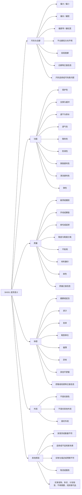
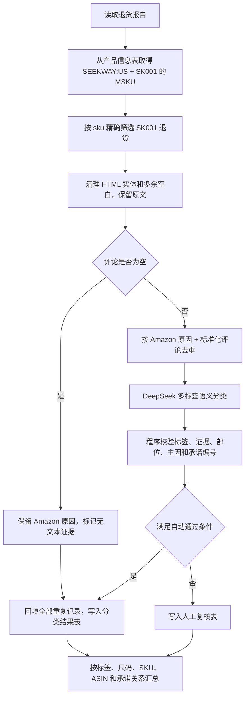

# SK001 退货语义分类业务逻辑

## 1. 文档目的

本文定义 `SEEKWAY:US` 店铺、`SK001` Listing 的退货语义分类规则。

首版只处理涉水鞋 SK001，不处理冬季手套，不建立通用 Listing 映射，也不关联供应商资料。模型采用 DeepSeek。模型负责理解评论语义，程序负责数据关联、字段校验、置信度判断和结果输出。

业务结果分别服务于：

- 运营负责人：检查标题、五点、A+、尺码表是否造成错误预期。
- 产品经理：识别尺码结构、穿着体验和功能设计问题。
- 供应链：观察破损、开裂、脱胶等质量信号；当前只定位到 SKU，不归因到具体供应商。

## 2. 当前范围

| 项目 | 首版规则 |
| --- | --- |
| 店铺 | `SEEKWAY:US` |
| Listing | `SK001` |
| 品类 | 涉水鞋，内部品类为“薄底水鞋” |
| 退货数据 | `input_data/SEEKWAY_US_.csv` |
| 产品关系 | `input_data/产品信息_20231103.xlsx` |
| 产品关联键 | `店铺/站点 = SEEKWAY:US`、`Listing = SK001` 后取得 `MSKU` 集合，再用退货报告的 `sku` 精确匹配 |
| Listing 内容 | 本文记录的 SK001 Amazon 页面快照 |
| 模型 | DeepSeek，优先使用 `deepseek-v4-pro` |
| 输出 | 分类结果表、人工复核表 |
| 多标签 | 允许一条记录有多个问题 |
| 主因 | 可以为空、一个或多个并列主因 |
| 正面信息 | 单独保留，不计入退货原因 |
| 风险偏好 | 宁可不自动判断，也不接受误报 |

不在首版范围内：

- 冬季手套及其他 Listing。
- 供应商资料关联和供应商责任判定。
- 从 Amazon 自动维护全量 Listing 与 SKU 的关系。
- 根据单条评论直接下结论或触发业务处罚。
- 用当前 Amazon 页面倒推历史 Listing 内容。

## 3. 当前数据基线

统计口径为 2026-08-05 本地文件快照。

| 指标 | 数值 |
| --- | ---: |
| SK001 产品 SKU 数 | 280 |
| 退货记录数 | 9,119 |
| ASIN 数 | 117 |
| 退货日期范围 | 2026-01-01 至 2026-08-03 |
| 有有效评论的记录 | 5,740 |
| 无有效评论的记录 | 3,379 |
| 去重后的“Amazon 原因 + 标准化评论”组合 | 3,338 |
| 含 `|` 问卷分隔符的有效评论 | 2,043，占有效评论 35.59% |
| 以 `|No` 结尾的有效评论 | 600 |

Amazon 原因字段的主要分布：

| Amazon 原因 | 数量 | 占全部退货 |
| --- | ---: | ---: |
| `APPAREL_TOO_SMALL` | 3,197 | 35.06% |
| `APPAREL_TOO_LARGE` | 1,850 | 20.29% |
| `UNWANTED_ITEM` | 917 | 10.06% |
| `DID_NOT_LIKE_FABRIC` | 567 | 6.22% |
| `APPAREL_STYLE` | 564 | 6.18% |
| `NOT_AS_DESCRIBED` | 550 | 6.03% |
| `QUALITY_UNACCEPTABLE` | 236 | 2.59% |
| `DEFECTIVE` | 207 | 2.27% |

`APPAREL_TOO_SMALL` 与 `APPAREL_TOO_LARGE` 合计 5,047 条，占 55.35%。这只是退货构成，不是退货率。缺少各尺码销量时，不能据此判断哪个尺码卖得更差或退货率更高。

## 4. 证据分层

分类时必须区分以下四类信息。

| 证据 | 用途 | 能否直接作为事实 |
| --- | --- | --- |
| 客户评论 | 判断客户实际表达的问题、正面反馈和使用场景 | 是客户陈述，不等于客观事实 |
| Amazon 原因 | 提供退货背景，辅助处理空评论和歧义 | 不能覆盖评论语义，也不能当训练真值 |
| Listing 原文 | 判断商品向买家作出了什么承诺 | 只能证明页面如何描述商品 |
| 产品信息表 | 关联店铺、MSKU、品类和 Listing | 可以作为内部关系数据；“薄底水鞋”不等于“质量差” |

基本原则：

1. 评论是语义分类的第一证据。
2. Amazon 原因是弱证据。原因与评论冲突时进入人工复核。
3. Listing 声明不是产品客观事实。评论与声明冲突，只能标记“疑似承诺不符”。
4. 没有评论时不让模型推测具体问题，只保留 Amazon 原因和“无文本证据”状态。
5. 不把“薄底设计”自动判为缺陷。客户明确表达硌脚、保护不足或与页面描述不符时，才形成对应问题标签。

## 5. SK001 Listing 证据快照

### 5.1 采集信息

| 字段 | 内容 |
| --- | --- |
| 采集日期 | 2026-08-05 |
| 代表 ASIN | `B0834N2546` |
| Amazon 页面 | <https://www.amazon.com/dp/B0834N2546> |
| 适用范围 | 当前页面展示的 SK001 变体族内容 |
| 限制 | Amazon 页面会调整，以下内容不能证明历史退货发生时页面也完全相同 |

另抽查较新的子体 `B0D5MH1DJN`，页面仍显示相同的 SK001 标题和 A+ 模块。首版把这些内容作为 SK001 当前 Listing 证据，但不做历史版本推断。

### 5.2 标题原文

> SEEKWAY Water Shoes Quick-Dry Aqua Socks Barefoot Slip-on for Beach Pool Swim River Yoga Lake Surf Women Men Black SK001

### 5.3 商品属性原文

| 属性 | Amazon 页面内容 |
| --- | --- |
| Fabric type | `92% polyester` |
| Sole material | `Rubber` |
| Outer material | `Polyester` |
| Inner material | `Spandex` |

这些字段来自 Listing，只能作为页面声明使用。

### 5.4 五点原文

1. `SEEKWAY： Not just for protection, but also for company.`
2. `Amphibious Protection：This shoes was designed for both water use and dry land. The rubber outsole can protects feet from sharp objects like rocks, gravel, shells and from being burned by hot sand or boardwalk.The non-slip stripe on the soles can provides superior grip even on slippery surfaces.`
3. `Lightweight & Flexiblity：It makes you feel like wearing socks, providing you with soothing and comfortable fit.Flexibility allows you plenty the freedom of movement.The lace-free design makes it easy to put on and take off.`
4. `Breathability & Comfort：Soft and elastic spandex upper can dry quickly and fit snugly to your feet,giving you comfortable tight feel overall.The smooth elastic neck prevents chafing and keeps the shoes from slipping off during exercise.`
5. `Occasion：River,Pool,Lake,Surf,Rafting,Windsurfing,Boating,Kayaking,Snorkeling,Sailing,Creek trip,Water park,Sand volleyball,Water aerobics,Travel,Camping,Canoeing,Wake-boarding,Fishing,Gardening,Yoga,Outdoor.`

### 5.5 A+ 原文

A+ 模块标题：

- `QUICK-DRYING`
- `DURABILITY & NON-SLIP`
- `COMFORTABLE`
- `STYLE DISPLAY`
- `SIZE SELECT`

A+ 图片中的主要文案：

> Breathable & Permeable Material
>
> The upper's mesh breathable material, along with drainage holes on the rubber outsole, ensures dryness and foot health.

> High-Quality Rubber Sole
>
> A high-quality rubber outsole boasts exceptional durability and non-slip, delivering stable traction on various surfaces, and also possess remarkable flexibility and softness.

> Wide Toe Box
>
> A wide toe box that allows your toes to naturally splay, promoting healthy toe development.

> Zero-drop
>
> A flat outsole offers the optimal base for a natural and upright posture.

### 5.6 页面尺码表

页面内置尺码表提示：

> US Unisex Water Shoes; If between 2 sizes, it is recommended to choose a larger size

| Brand Size | EU | Heel to toe |
| --- | --- | --- |
| 3-4 Women / 2-3 Men | 34-35 | 8.4-8.8 in |
| 5-6 Women / 3.5-4 Men | 36-37 | 9.0-9.2 in |
| 7-8 Women / 5.5-6.5 Men | 38-39 | 9.4-9.6 in |
| 8.5-9.5 Women / 7.5-8.5 Men | 40-41 | 9.8-10.2 in |
| 10-11 Women / 9-10 Men | 42-43 | 10.4-10.8 in |
| 11.5-12.5 Women / 10.5-11.5 Men | 44-45 | 11.0-11.4 in |
| 13-14.5 Women / 12.5-13.5 Men | 46-47 | 11.6-12.2 in |

### 5.7 A+ 尺码图

A+ 图片按 35 至 48 的单码展示，第一列标题写成 `UK SIZE`，同时列出 US Women、US Men、英寸和厘米。图片还建议体型偏大时选大一码、体型偏瘦时选小一码。

这与页面按 `34-35、36-37……46-47` 成对售卖的方式不一致。当前已确认的 Listing 风险有：

- 页面尺码表使用成对尺码，A+ 使用单码。
- A+ 第一列写成 `UK SIZE`，但 35 至 48 的数值与通常的 UK 尺码表达不一致。
- 页面建议临界值选大一码，A+ 又增加按体型选大或选小的规则。
- 成对尺码容易出现当前档偏小、下一档偏大的断层。

客户评论中已经出现直接证据：

> Confusing to order with sizing chart, one size too big, this one too small. Too large of sizing range, not accurate.

## 6. Listing 承诺表

模型不能直接读取一大段 Listing 后自行总结承诺。首版使用下列固定承诺编号，便于追溯。

| 承诺编号 | Listing 承诺 | 来源 |
| --- | --- | --- |
| `CLM_SIZE_01` | 临界两个尺码时建议选大一码 | 页面尺码表 |
| `CLM_SIZE_02` | 宽鞋头允许脚趾自然展开 | A+ |
| `CLM_DRY_01` | 鞋面和鞋底排水孔有助于快速干燥 | 五点、A+ |
| `CLM_SLIP_01` | 湿滑表面或多种表面有稳定抓地力 | 五点、A+ |
| `CLM_PROTECT_01` | 鞋底可防护岩石、碎石、贝壳和热沙 | 五点 |
| `CLM_DURABLE_01` | 橡胶鞋底耐用 | A+ |
| `CLM_COMFORT_01` | 穿着舒适、贴合 | 五点、A+ |
| `CLM_CHAFE_01` | 弹性鞋口可防止磨脚 | 五点 |
| `CLM_RETENTION_01` | 运动时不易脱脚 | 五点 |
| `CLM_ONOFF_01` | 无鞋带设计方便穿脱 | 五点 |
| `CLM_BREATH_01` | 鞋面透气 | 五点、A+ |
| `CLM_FLEX_01` | 鞋体柔软、有弹性、活动自由 | 五点、A+ |
| `CLM_USE_01` | 可用于水中和陆地，以及页面列出的活动 | 五点 |

只有评论明确表达了相反体验时，才能把问题与承诺关联。例子：

- `No grip, very slippery` 可以关联 `CLM_SLIP_01`。
- `The sole is thin` 不能自动关联 `CLM_PROTECT_01`；如果评论同时说岩石硌脚或没有保护，才可以关联。
- `My feet got wet` 不能自动判为违反快速干燥承诺，因为 Listing 没有承诺防水。

## 7. 分类结果的数据结构

每条标签必须包含以下语义字段：

```text
标签 = {
  标签编码,
  标签名称,
  一级分类,
  正负面,
  部位,
  证据原文,
  置信度,
  Listing承诺关系,
  Listing承诺编号
}
```

记录级字段：

```text
记录分类 = {
  问题标签: [标签, ...],
  正面标签: [标签, ...],
  主因标签: [标签编码, ...],
  是否人工复核,
  复核原因
}
```

规则如下：

- 问题标签允许多个。
- 正面标签单独存放，不计入退货原因。
- 主因标签只能来自问题标签。
- 无法判断主因时，主因标签为空。
- 两个问题贡献相当时，主因标签可以有两个或多个。
- 每个自动标签必须有评论中的原文证据，不能只引用 Amazon 原因或 Listing。

## 8. 分类树



功能类标签和质量、体感类标签可能同时成立。例如“鞋底太薄，在石头上走很疼”可以同时得到：

- 体感 / 偏薄
- 功能 / 保护性差
- 体感 / 其他不舒服

是否把“保护性差”关联到 `CLM_PROTECT_01`，取决于评论是否明确提到石头、尖锐物、热沙或保护不足。

## 9. 部位字段

质量、尺码和体感问题应尽量记录部位，不从关键词强猜。

| 部位编码 | 中文名称 |
| --- | --- |
| `OUTSOLE` | 鞋底 |
| `TOE` | 鞋头或脚趾区 |
| `HEEL` | 鞋跟 |
| `INSOLE` | 鞋垫 |
| `OPENING` | 鞋口 |
| `UPPER` | 鞋面 |
| `SOLE_UPPER_SEAM` | 鞋底鞋面衔接处 |
| `HEEL_TAB` | 鞋后跟织带 |
| `ARCH` | 足弓位置 |
| `WHOLE_SHOE` | 整体 |
| `UNSPECIFIED` | 评论没有说明 |

例子：

- `Too tight on toes`：尺码 / 偏紧窄，部位为 `TOE`。
- `Opening is very small, hard to get on`：尺码 / 偏紧窄和功能 / 穿脱不便，部位为 `OPENING`。
- `The seam on one shoe has a hole in it`：质量 / 破洞，部位需要根据上下文判断；信息不足时用 `UNSPECIFIED`，不能猜成鞋底鞋面衔接处。

## 10. 语义判断规则

### 10.1 先拆语义，再映射标签

模型按以下顺序处理评论：

1. 识别 Amazon 问卷结构和自然语言句子。
2. 拆出每个独立观点。
3. 判断观点的对象、部位、正负面和使用场景。
4. 把有明确证据的观点映射到标签。
5. 判断问题是否直接对应某条 Listing 承诺。
6. 再判断主因；信息不足时留空。

`Too Small|Length too short|No` 中的 `No` 通常是问卷附加问题的回答，不能理解为否定“偏小”或“偏短”。

### 10.2 Amazon 原因与评论冲突

Amazon 原因不能覆盖评论。下面几种情况进入人工复核：

- 原因为 `APPAREL_TOO_SMALL`，评论明确说商品偏大。
- 原因为 `APPAREL_TOO_LARGE`，评论明确说商品偏小。
- 评论同时描述不同方向的问题，且无法确认是在比较两次购买还是同一双鞋的不同部位。
- 评论只是在引用评论区或描述购买预期，不是在评价收到的商品。

例如：

> Reviews say runs small

这句话不能单独判为“收到的鞋偏小”。

### 10.3 正面与负面并存

一句评论可以同时有正面和负面信息：

> It was too small for my son, overall nice water shoes.

应输出：

- 问题标签：尺码 / 偏小
- 正面标签：整体正面评价
- 主因：尺码 / 偏小

`not comfortable`、`not very good quality` 等否定表达不能因为出现 `comfortable` 或 `good quality` 而被判为正面。

### 10.4 关键词歧义

关键词只能用于召回候选，不能直接完成分类。

| 词 | 可能的不同含义 |
| --- | --- |
| `slip` | 鞋底打滑、鞋容易脱脚、slip-on 穿脱结构 |
| `hole` | 产品破洞、鞋底设计的排水孔 |
| `dry` | 速干、脚保持干燥、防水期待、单纯描述使用环境 |
| `wide` | 鞋太宽、宽鞋头正面评价、脚型较宽 |
| `light` | 轻便、浅色、光线 |
| `hot` | 热沙保护、鞋内闷热、天气炎热 |
| `support` | 足部支撑、客服支持 |
| `fit` | 合脚、不合脚、商品是否适用于某场景 |
| `No` | 问卷回答、否定词、无补充意见 |

### 10.5 不能过度推断

- `Not as expected` 可以标记“实物与预期不符”，不能继续猜测具体是尺码、材质还是性能。
- `Poor quality` 可以标记笼统质量差；没有部位时不能补写破洞、开线或脱胶。
- `Too thin` 没有对象时，不能确定是鞋底、鞋面还是整体体感。
- `My feet got wet` 不能标记“不速干”或“不防水”，除非评论提供了干燥时间或明确说明水无法排出。
- `Used for hiking and hurt` 不一定是质量缺陷，可能是使用场景与薄底设计不匹配。

## 11. 主因规则

主因表示客户最终退货的直接原因，不等于最严重的问题。

| 评论情况 | 主因处理 |
| --- | --- |
| 只有一个明确问题 | 该问题作为主因 |
| 多个问题，有明确因果或强调顺序 | 选择评论明确强调的原因 |
| 多个问题贡献相当 | 保留并列主因 |
| 只有正面信息 | 主因为空，进入复核或结合明确的买家原因处理 |
| 只有 `Not as expected` 等笼统表达 | 使用笼统标签，不猜具体主因 |
| 没有评论 | 主因为空，只保留 Amazon 原因 |

模型不能为了满足“必须有主因”而强行选择一个标签。

## 12. Listing 承诺关系

每个问题标签可记录以下关系：

| 关系 | 含义 |
| --- | --- |
| `CONTRADICTS` | 评论直接描述了与 Listing 承诺相反的体验 |
| `SUPPORTS` | 正面反馈直接支持 Listing 承诺 |
| `RELATED_UNCERTAIN` | 与承诺有关，但证据不足以判断支持或冲突 |
| `NONE` | 与 Listing 承诺没有直接关系 |

单条 `CONTRADICTS` 只表示客户陈述与页面承诺冲突。是否修改 Listing 或产品，需要结合重复次数、涉及 SKU、时间和销量数据。

## 13. 自动通过和人工复核

### 13.1 自动通过条件

一条有评论的记录必须同时满足以下条件：

- 所有标签都来自规定的分类树。
- 每个标签都有可以在评论中定位的证据原文。
- 标签方向、部位和正负面与证据一致。
- 主因来自已经识别的问题标签。
- 没有未解释的 Amazon 原因冲突。
- 置信度达到首版阈值。

### 13.2 人工复核条件

出现以下任一情况即进入人工复核：

- 一句话存在多种合理解释。
- 否定、转折、比较、引用或代词指向不清。
- Amazon 原因与评论明显冲突。
- 同时出现偏大与偏小等相反方向，且上下文解释不清。
- 模型给出的证据不在原评论中。
- 模型输出了分类树之外的标签或部位。
- 只能判断笼统不满，但模型给出了具体缺陷。
- 只有正面信息，无法找到实际退货原因。
- Listing 承诺关系需要依赖未提供的客观产品信息。

人工复核目标是有效评论的 5% 至 10%，不是全部 9,119 条退货记录。3,379 条无评论记录单独标记为“无文本证据”，不进入没有意义的人工语义复核。

误报优先级高于复核比例。如果首轮高风险样本超过 10%，不能为了压低复核量而降低标准。

## 14. 数据处理流程



发送给 DeepSeek 的内容只包括分类所需的评论、Amazon 原因和固定的 SK001 语义上下文，不发送订单号、库位、license plate number 等无关字段。

## 15. 结果表

分类结果表保留全部 9,119 条记录，至少包含：

| 字段 | 说明 |
| --- | --- |
| 源数据行号 | 回查原始文件 |
| return-date | 退货时间 |
| sku | MSKU |
| asin | ASIN |
| Amazon原因 | 原始 `reason` |
| 评论原文 | 原始 `customer-comments` |
| 问题标签 | 可多值 |
| 正面标签 | 可多值，不计入退货原因 |
| 主因标签 | 可为空或多值 |
| 部位 | 可多值并与标签对应 |
| 证据原文 | 每个标签对应的评论片段 |
| Listing承诺关系 | `CONTRADICTS`、`SUPPORTS`、`RELATED_UNCERTAIN` 或 `NONE` |
| Listing承诺编号 | 如 `CLM_SLIP_01` |
| 置信度 | 模型置信度，不能单独决定自动通过 |
| 处理状态 | 自动通过、人工复核、无文本证据 |
| 复核原因 | 未通过自动校验的具体原因 |

人工复核表只包含需要判断的有效评论，并保留模型建议、证据、冲突点和供人工填写的最终标签。

## 16. 业务动作

| 信号 | 主要负责人 | 处理方式 |
| --- | --- | --- |
| 尺码表冲突、描述不符、承诺冲突 | 运营负责人 | 修改尺码说明、标题、五点或 A+，减少过度承诺 |
| 尺码结构、鞋口、鞋头、足弓、鞋底保护和使用体验 | 产品经理 | 判断楦型、尺码段、结构和使用场景是否需要调整 |
| 破洞、开线、撕裂、脱胶、掉色等重复质量问题 | 供应链 | 先按 SKU 和 ASIN 聚合；接入供应商资料后再做供应商管理 |
| 买家计划改变、不再需要、误购、物流等 | 非产品问题 | 与产品和供应商问题分开统计 |

业务动作依据聚合结果，不依据单条评论。聚合时至少同时查看评论数量、涉及 SKU 数、时间分布和销量分母；当前没有销量分母时，只报告退货构成和评论出现次数。

## 17. SK001 首轮重点验证项

以下数量来自高精度关键词召回，只用于确定 DeepSeek 首轮抽样范围，不是最终分类结果。

| 主题 | 候选记录数 | 与 Listing 的关系 |
| --- | ---: | --- |
| 防滑差、无抓地力 | 27 | 可能冲突 `CLM_SLIP_01` |
| 难穿或难脱 | 19 | 可能冲突 `CLM_ONOFF_01` |
| 紧、窄或挤压 | 171 | 需要区分鞋头、鞋口、足弓和整体尺码 |
| 薄底、硌脚或保护不足 | 13 | 部分可能冲突 `CLM_PROTECT_01` |
| 开裂、破洞、撕裂或散架 | 21 | 可能冲突 `CLM_DURABLE_01` |
| 磨脚或起泡 | 6 | 需要区分鞋口、鞋跟和内侧接缝 |
| 排水或干燥问题 | 1 | 关键词召回偏窄，最终以语义分类为准 |

首轮 DeepSeek 校准样本应覆盖：

- 高频尺码评论。
- Amazon 原因与评论方向冲突的评论。
- 带 `|` 的 Amazon 问卷式评论。
- 同时包含正面和负面信息的评论。
- 与防滑、保护、速干、穿脱、耐用和宽鞋头承诺有关的评论。
- `Not as expected`、`Poor quality` 等信息不足的短评论。

## 18. 验收标准

首版通过以下条件后才能进行全量输出：

1. 只处理 `SEEKWAY:US + SK001`，筛选结果为 9,119 条。
2. 无评论记录没有生成具体语义标签。
3. 一条评论可以输出多个问题和多个并列主因。
4. 正面信息保留在独立字段，不计入退货原因。
5. 自动标签都能回指评论中的证据原文。
6. Listing 承诺关系只能引用本文的承诺编号。
7. Amazon 原因与评论冲突时不会静默覆盖评论。
8. 人工复核比例以有效评论为分母，目标为 5% 至 10%；不能为了达到比例放行低置信度结果。
9. 输出分类结果表和人工复核表，原始数据文件不被修改。
10. 同一批输入和模型配置重复运行时，分类结构保持稳定；无法稳定判断的记录进入复核。

## 19. 后续扩展原则

新增太阳眼镜、遮阳帽或其他品类时，保留以下通用结构：

- 问题标签、正面标签和主因分开。
- 标签必须带证据、正负面和置信度。
- Listing 声明与产品事实分开。
- 空评论不做语义推断。
- 模型只从当前品类允许的标签中选择。

各品类需要单独增加：

- 品类分类树和部位枚举。
- 该品类的 Listing 承诺表。
- 容易混淆的关键词和判定边界。
- 该品类的校准样本。

因此，当前框架的记录结构可以复用，涉水鞋的叶子标签不能直接套用到太阳眼镜或遮阳帽。
