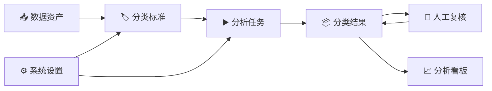
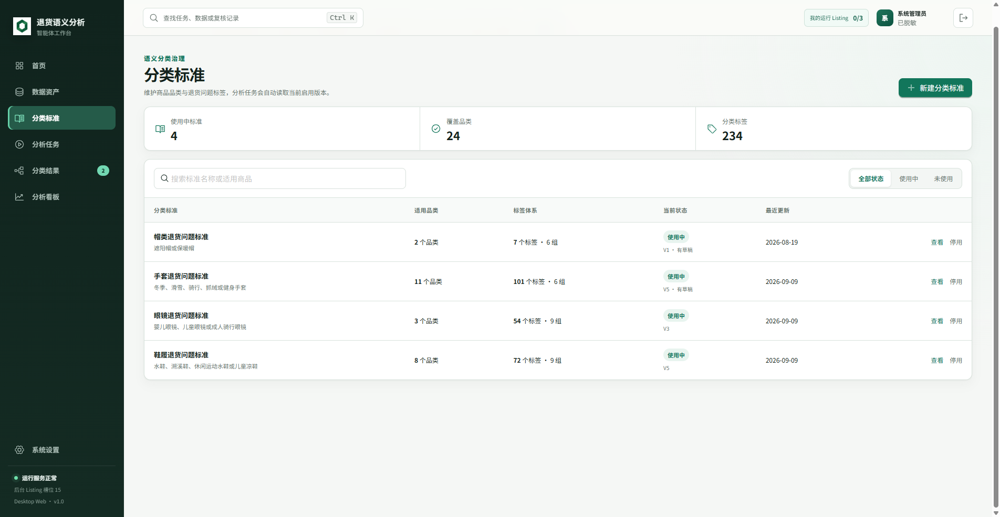
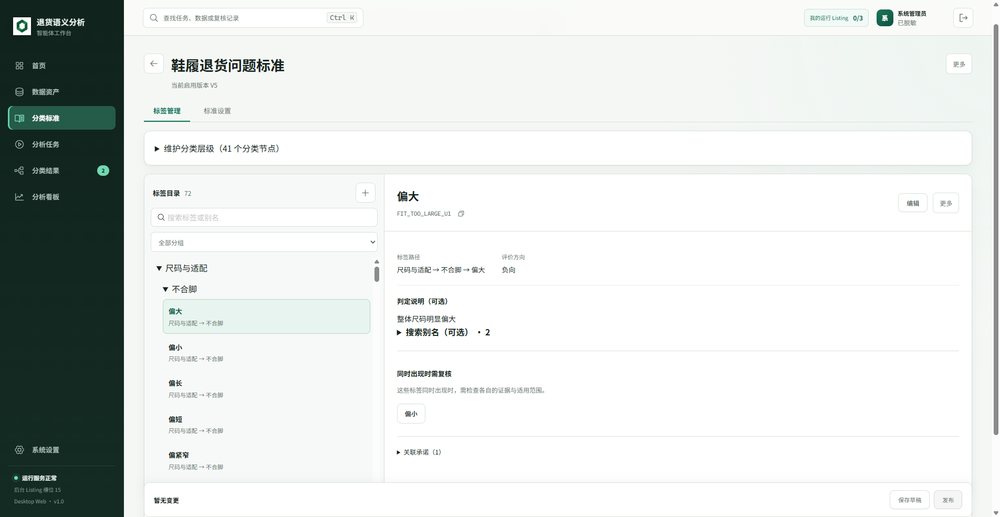
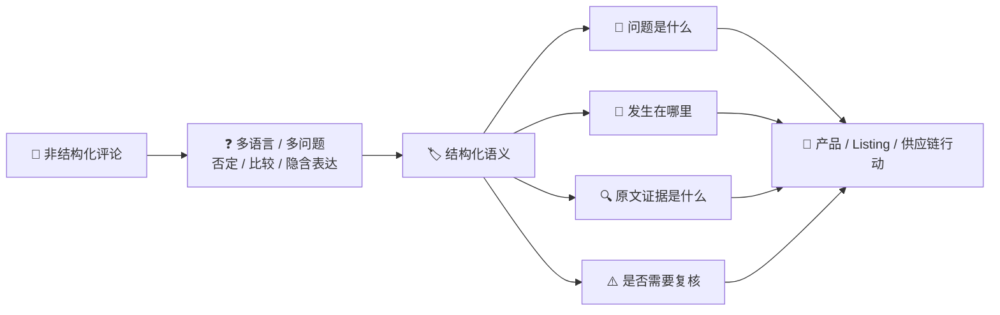
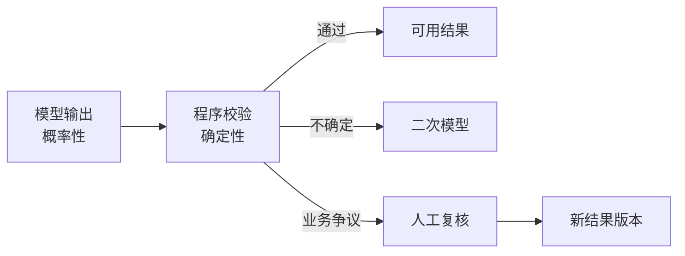
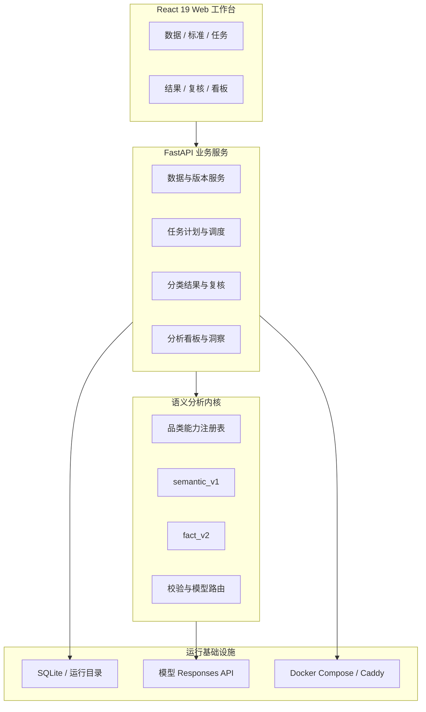
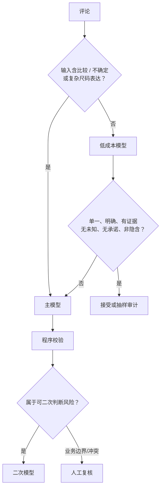
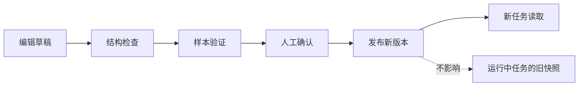

# 退货语义分析智能体｜项目汇报

> **汇报日期：** 2026-09-14<br>
> **事实口径：** 当前源码、当前启用的分类标准、2026-09-14 本地实际运行页面<br>
> **一句话定位：** 把退货评论转化为**有证据、可复核、可统计、可追溯**的产品问题数据资产。

---

## 01｜管理层摘要

| 状态 | 当前结论 |
|:---:|---|
| ✅ | 已形成“数据资产 → 分类标准 → 分析任务 → 分类结果 → 人工复核 → 分析看板”产品闭环 |
| ✅ | 当前启用 **4 套分类标准 / 24 个品类 / 234 个叶子标签** |
| ✅ | 任务按 Listing 拆分运行，结果按 Listing 独立发布不可变版本 |
| ✅ | 每条语义结论可下钻到订单、原评论、标签、证据和处理状态 |
| 🟡 | 工程能力已具备；业务准确率仍需金标准验收 |
| 🔴 | 当前运行页提示仍使用研发安全配置，不能直接作为生产环境上线 |

> ### 核心设计
>
> **🧠 模型理解语义　＋　🛡️ 程序执行规则　＋　👤 人工处理不确定性**

---

## 02｜当前产品形态



| 页面 | 当前实际能力 |
|---|---|
| 🏠 首页 | 待处理事项、后台进度、最近产出 |
| 📥 数据资产 | 退货数据、产品信息、版本与质量检查 |
| 🏷️ 分类标准 | 层级、标签、规则、样本验证、草稿与发布 |
| ▶️ 分析任务 | Listing 队列、并行数、暂停/继续、日志、快照 |
| 📦 分类结果 | 质量对账、层级下钻、订单明细、证据抽屉、版本历史 |
| 👤 人工复核 | 批次处理、修改原因、多人冲突保护、派生版本 |
| 📈 分析看板 | 从已发布结果生成不可变分析数据集 |
| ⚙️ 系统设置 | 模型接入、模型角色、运行限制、账号与存储 |

### 当前运行页面｜分类标准总览



### 当前运行页面｜鞋履标签管理



> 截图取自当前运行系统；账号信息已脱敏。旧版原型截图不再作为汇报依据。

---

## 03｜业务问题与项目目标



| 原始数据 | 系统输出 |
|---|---|
| Amazon 粗粒度原因 | 具体问题标签与主要原因 |
| 客户自由文本 | 原子语义、评价方向、部位、对象 |
| 无法解释的模型结论 | 可回查的连续原文证据 |
| 一次性分析结果 | 可发布、可复核、可派生的版本化数据资产 |

---

## 04｜设计立意：受控智能，而非自由智能体

### 第一性原理

| 能力主体 | 擅长 | 不擅长 | 系统分工 |
|---|---|---|---|
| 🧠 大模型 | 语言理解、隐含语义、多问题拆分 | 严格遵守目录、稳定复现、绝对不越界 | 只负责提出结构化语义结论 |
| 🛡️ 程序 | 精确匹配、白名单、冲突判断、版本控制 | 理解复杂自然语言 | 负责验证、分流、发布和审计 |
| 👤 人工 | 处理歧义、业务边界和新问题 | 大规模逐条处理成本高 | 只处理机器无法可靠决定的部分 |



### 设计原则

`客户原文是事实边界`　｜　`标签是业务口径`　｜　`模型不能修改口径`<br>
`未知必须暴露`　｜　`人工修改必须留痕`　｜　`运行配置必须冻结`

---

## 05｜整体技术架构



| 层 | 技术 | 作用 |
|---|---|---|
| 前端 | React 19、Vite、Ant Design、Phosphor Icons、Recharts | 运行驾驶舱与业务下钻 |
| 后端 | FastAPI、Pydantic、Uvicorn | API、权限、任务与业务服务 |
| 语义内核 | Python、规则校验、两类识别链路 | 语义抽取、路由、复核分流 |
| 数据 | pandas、openpyxl、SQLite，可选 MySQL 数据源 | 读取、关联、清洗、持久化 |
| 模型 | Sub2API Responses API | JSON 结构化生成与多模型角色 |
| 部署 | Docker Compose、Caddy | 容器运行、HTTPS、备份基础能力 |

---

## 06｜当前启用的标签体系

### 当前运行口径

| 分类标准 | 启用版本 | 品类 | 叶子标签 | 分组 | 识别链路 |
|---|:---:|---:|---:|---:|---|
| 🧢 帽类 | V1 | 2 | 7 | 6 | 兼容模式 |
| 🧤 手套 | V5 | 11 | 101 | 6 | `fact_v2` |
| 🕶️ 眼镜 | V3 | 3 | 54 | 9 | `semantic_v1` |
| 👟 鞋履 | V5 | 8 | 72 | 9 | `semantic_v1` |
| **合计** |  | **24** | **234** |  |  |

> **口径修正：** 当前启用版本由数据库中的已发布分类标准决定。仓库 `config/*.json` 是初始配置或回退来源，不能代替运行中的版本事实。

### 不是一张平面标签表


| 层级对象 | 示例 / 属性 |
|---|---|
| 智能体族 | 鞋履、手套、眼镜、帽类 |
| 适用品类 | 水鞋、滑雪手套、骑行眼镜、儿童渔夫帽等 |
| 分类节点 | 尺码与适配 → 不合脚 |
| 叶子标签 | 偏大、偏小、偏紧窄等 |
| 标签属性 | 编码、路径、评价方向、判定说明、排除说明、示例 |
| 规则属性 | 冲突标签、允许部位、允许承诺、维度契约、兜底标签 |

### 当前层级规模

| 标准 | 分类节点 | 叶子标签 | 说明 |
|---|---:|---:|---|
| 👟 鞋履 | 41 | 72 | 完整层级结构 |
| 🧤 手套 | 28 | 101 | `fact_v2`，标签最丰富 |
| 🕶️ 眼镜 | 40 | 54 | 完整层级结构 |
| 🧢 帽类 | 0 | 7 | 旧版平面结构，依赖兼容处理 |

### 标签治理亮点

| ✨ 设计 | 🎯 目的 |
|---|---|
| 标签编码与显示名称分离 | 名称可优化，历史结果不失联 |
| 父节点与叶子标签分离 | 模型只能输出可执行的叶子标签 |
| 评价方向白名单 | 同一标签只接受允许的正/负/中性方向 |
| 搜索别名不参与模型判断 | 避免运营搜索词污染语义规则 |
| 未知语义独立保存 | 用真实缺口驱动标签迭代 |
| 草稿、验证、发布三阶段 | 运行中的任务不被未发布修改影响 |

---

## 07｜一条评论的完整处理链


### 关键技术点

| 环节 | 实现细节 | 立意 |
|---|---|---|
| 数据读取 | 固定读取退货字段、产品关系与品类字段 | 控制输入范围 |
| 评论标准化 | HTML 解码、空白归一、保留原文 | 统一比较口径，不破坏证据 |
| 语义去重 | 相同分类键只调用一次模型，再回填原始记录 | 降低模型成本 |
| 品类路由 | `品类A + 品类B` 解析到当前启用智能体 | 不让评论反向猜品类 |
| Listing 分段 | 每个 `店铺 / Listing / 智能体` 独立执行 | 故障隔离、独立发布 |
| 运行快照 | 固化标准、模型、提示词、承诺和计划哈希 | 保证可复现 |

### 无法执行的数据不会混入模型

`商品未匹配` → `excluded`<br>
`品类缺失` → `excluded`<br>
`未支持品类` → `blocked`<br>
`可解析品类` → 对应智能体分段

---

## 08｜`semantic_v1`：直接语义单元链路

> 当前用于：**鞋履 V5、眼镜 V3**


### 每个语义单元

| 字段 | 含义 |
|---|---|
| `subject` | 商品、客户、订单、物流、服务等责任对象 |
| `label_code` | 当前分类标准中的叶子标签编码 |
| `opinion` | 结构化观点 |
| `sentiment` | `NEGATIVE / POSITIVE / NEUTRAL` |
| `assertion` | `AFFIRMED / NEGATED / UNCERTAIN` |
| `part` | 商品部位 |
| `evidence` | 评论中的连续原文子串 |
| `implicit` | 是否为隐含表达 |
| `claim_relation` | 与 Listing 承诺的支持、冲突、不确定或无关系 |

### 关键约束

- 📌 一条评论可拆成多个语义单元。
- 📌 正面和负面信息分别保留。
- 📌 `evidence` 必须逐字存在于原评论。
- 📌 主因只能从已经确认的负面标签或允许的中性买家原因中选择。
- 📌 只支持父级、无法落到叶子标签时，进入未知语义并复核。
- 📌 单独的 “No” 不自动否定前文观点。

---

## 09｜`fact_v2`：事实优先的多阶段链路

> 当前用于：**手套 V5**


### 为什么增加事实层

| 复杂场景 | `fact_v2` 的处理方式 |
|---|---|
| 多个人物 | 区分评论者、其他使用者和信息来源 |
| 多个商品 | 区分当前商品、对比商品和配件 |
| 多个时间/事件 | 用 `event_ref` 避免把不同事件合并 |
| 条件、因果、比较 | 记录事实角色与事实关系 |
| 证据只是上下文 | 不把上下文误升级为独立业务标签 |
| 泛化结论与具体故障重复 | 通过覆盖关系只保留最具体结论 |

### 事实结构

`人物 actor/source/experiencer`<br>
`商品 product/variant`<br>
`事件 event`<br>
`事实角色 CONCLUSION / EVIDENCE / CONTEXT`<br>
`关系 COVERED_BY / SUPPORTS / QUALIFIES / CAUSED_BY`<br>
`归因 PRODUCT / CUSTOMER / DELIVERY / ORDER / SERVICE / EXTERNAL`

### 多阶段职责

| 阶段 | 只做一件事 |
|---|---|
| ① 抽取 | 找出原文明确存在的原子事实 |
| ② 覆盖审计 | 检查首轮是否漏掉独立事实 |
| ③ 映射 | 每个事实只在允许的标签分支中选择末端标签 |
| ④ 裁决 | `ACCEPT / REPLACE / ABSTAIN / REVIEW` |
| ⑤ 维度决策 | 同一业务维度、同一作用域只保留一个最终判断 |
| ⑥ 编译 | 生成统一的语义单元、主因、未知和复核原因 |

### 容错方式

某阶段输出校验失败 → **只修复该阶段一次** → 已通过阶段不重复调用。

### 当前限制

> ⚠️ `fact_v2` 的 Listing 承诺关系尚未完成自动核验；存在承诺配置时，代码会强制进入人工确认，不做自动推断。

---

## 10｜模型路由：准确率、成本与速度平衡

### 当前智能体策略

| 智能体 | 首轮角色 | 风险复核角色 |
|---|---|---|
| 👟 鞋履 | 低成本模型 | 二次复核模型 |
| 🧤 手套 | 主模型 | 主模型 |
| 🕶️ 眼镜 | 主模型 | 二次复核模型 |
| 🧢 帽类 | 低成本模型 | 主模型 |

### 路由逻辑



### 低成本结果的自动接受条件

`AUTO_APPROVED`　＋　`仅 1 个语义单元`　＋　`仅 1 个问题标签`<br>
`仅 1 个主因`　＋　`无未知语义`　＋　`非隐含`　＋　`无承诺关系`

### 二次模型不会替代人工边界

以下情况直接保留人工复核：

- Amazon 原因与评论方向冲突
- 相反标签或需核对标签组合
- 标签规则明确要求人工复核
- 语义边界需要人工确认
- `fact_v2` Listing 承诺关系待确认

---

## 11｜程序校验：把概率输出变成受控结果


### 硬校验

| 检查 | 拦截内容 |
|---|---|
| JSON Schema | 缺字段、错类型、非法枚举 |
| 标签白名单 | 模型自创标签、返回父节点 |
| 原文证据 | 证据不在评论中、拼接证据 |
| 评价方向 | 标签不允许当前情绪方向 |
| 部位白名单 | 部位不适用于当前品类 |
| 承诺映射 | 无效承诺编号、标签与承诺不匹配 |
| 主因约束 | 主因不是已经确认的问题标签 |

### 软风险

| 风险 | 默认处理 |
|---|---|
| Amazon 原因与评论冲突 | 二次或人工复核 |
| 同一作用域出现相反标签 | 人工复核 |
| 模型主动请求复核 | 二次或人工复核 |
| 只有正面信息但处于退货场景 | 复核退货原因 |
| 分类体系无法覆盖 | 未知语义池 |

### 内部处理状态

| 状态 | 含义 |
|---|---|
| `AUTO_APPROVED` | 程序校验通过 |
| `SECONDARY_REVIEW` | 可交给风险复核模型 |
| `MANUAL_REVIEW` | 必须人工判断 |
| `UNKNOWN_SEMANTIC` | 有明确语义，但标签体系未覆盖 |
| `NO_TEXT_EVIDENCE` | 无有效评论证据 |
| `MODEL_ERROR` | 模型或解析异常 |
| `MANUAL_RESOLVED` | 人工已经完成处理 |

结果池再汇总为：`ready / review_required / unusable / excluded`。

---

## 12｜缓存、并发与故障恢复

### 缓存不是只按评论文本

```text
cache_key = SHA256(
  评论 + 模型 + 提示词版本 + 标签版本 + Listing承诺版本
  + 品类作用域 + 推理强度 + 模型策略版本 + 识别链路指纹 + 服务商
)
```

**立意：** 配置相同才能复用；任何会改变语义结果的因素变化，缓存自动失效。

### 运行保护

| 机制 | 技术细节 |
|---|---|
| 🔒 同键锁 | 相同语义请求并发时只产生一次真实模型调用 |
| 🧵 线程池 | 唯一评论并行分类，集中统计模型用量与路由 |
| 🔁 失败重试 | 支持限流、`Retry-After` 与指数退避 |
| ⚠️ 服务降级 | 连续服务错误达到 3 次时发送降级事件 |
| ⏸️ 自动暂停 | 连续服务错误达到 5 次时停止继续消耗 |
| 💾 检查点 | 已完成 Listing 和分类单元可保留，后续继续未完成部分 |
| 🧩 Listing 隔离 | 单个 Listing 异常不抹掉其他 Listing 已形成的结果 |

---

## 13｜版本治理与人工复核闭环

### 分类标准生命周期



### 任务与结果生命周期


### 为什么复核不直接改原结果

| 做法 | 收益 |
|---|---|
| 原始版本保持不变 | 可回溯模型当时的真实输出 |
| 复核批次记录原因与操作者 | 明确业务责任和修改依据 |
| 使用 revision 乐观锁 | 防止多人同时覆盖 |
| 发布完整派生版本 | 下游始终读取完整、一致的数据集 |
| 看板只消费已发布版本 | 分析结果不随后台编辑静默变化 |

---

## 14｜当前成果判断

| 维度 | 当前状态 | 依据 |
|---|:---:|---|
| Web 产品闭环 | ✅ | 当前页面已覆盖数据、标准、任务、结果、复核、看板 |
| 分类标准治理 | ✅ | 4 套启用标准，支持层级编辑、验证、版本发布 |
| 多品类运行 | ✅ | 当前覆盖 24 个品类，任务按 Listing 分段 |
| 语义识别 | ✅ | `semantic_v1` 与 `fact_v2` 均已进入启用标准 |
| 结果追溯 | ✅ | 订单级分类、原文证据、质量对账、版本历史 |
| 人工闭环 | ✅ | 复核批次、修改留痕、派生版本 |
| 业务准确率验收 | 🟡 | 仍需金标准与盲测指标 |
| 生产安全配置 | 🔴 | 当前运行页仍提示研发安全配置 |

### 历史首轮基线｜仅用于说明项目起点

| SK001 退货记录 | 有效评论 | 去重后语义组合 |
|:---:|:---:|:---:|
| 9,119 | 5,740 | 3,338 |

> 当前项目已从 SK001 离线分析扩展为多品类 Web 协同系统；历史数字不代表当前全部业务规模。

---

## 15｜亮点、风险与下一步

### 项目亮点

| ✨ 亮点 | 价值 |
|---|---|
| 事实与标签分离 | 先理解“客户说了什么”，再决定“业务怎么归类” |
| 证据进入数据结构 | 结论不是黑盒，可直接回到原文 |
| 规则校验独立于模型 | 换模型不等于放弃业务边界 |
| 品类级智能体 | 共用平台能力，保留不同商品的专业规则 |
| 风险分层路由 | 简单问题低成本处理，复杂问题升级 |
| 未知语义池 | 用未知推动标签体系真实增长 |
| 不可变版本链 | 标准、任务、结果、复核、看板都可追溯 |

### 当前风险

| 优先级 | 风险 | 下一步 |
|:---:|---|---|
| 🔴 P0 | 缺少正式业务准确率验收 | 建立金标准、盲测、抽检和验收阈值 |
| 🔴 P0 | 当前运行环境仍为研发安全配置 | 更换初始密码和独立加密密钥，完成生产预检 |
| 🟠 P1 | 数据库启用标准与仓库初始配置存在差异 | 明确“已发布标准版本”为唯一运行事实源 |
| 🟠 P1 | 跨品类分组名称尚未完全统一 | 固化跨品类汇总语义层，不直接拼接组名 |
| 🟠 P1 | `fact_v2` 承诺关系尚未自动闭环 | 完成承诺证据核验后再允许自动通过 |
| 🟠 P1 | 帽类仍为 7 标签兼容结构 | 用真实帽类样本升级层级和识别链路 |
| 🟡 P2 | 生产恢复能力尚需演练 | 执行真实配置、备份、恢复与任务续跑演练 |

### 建议路线


### 需要管理层确认

- [ ] 🎯 首期正式使用范围与目标 Listing
- [ ] 👤 金标准标注与验收负责人
- [ ] 📏 标签准确率、证据通过率、人工复核率门槛
- [ ] 🚀 先内部试用还是直接进入生产准备
- [ ] 🏷️ 跨品类汇总口径由哪个业务部门最终确认

---

## 16｜汇报结论

> ### ✅ 项目已经从“调用大模型做分类”，发展为“可治理的语义数据生产系统”。

`先证明准确`　→　`再完成生产预检`　→　`小范围试用`　→　`扩品类与 Listing`

---

<details>
<summary><strong>附录｜源码与运行事实追溯</strong></summary>

| 主题 | 来源 |
|---|---|
| 核心架构原则 | [architecture/README.md:7](./architecture/README.md#L7) |
| 当前页面与导航 | [App.jsx:75](../web-prototype/src/App.jsx#L75) |
| 分类标准页面统计 | [ClassificationStandardsPage.jsx:156](../web-prototype/src/features/classification-standards/ClassificationStandardsPage.jsx#L156) |
| 分类标准列表设计 | [ClassificationStandardList.jsx:18](../web-prototype/src/features/classification-standards/ClassificationStandardList.jsx#L18) |
| 当前启用标准来自数据库版本 | [classification_standard_service.py:114](../web_backend/classification_standard_service.py#L114) |
| 分类标准草稿发布 | [classification_standard_service.py:796](../web_backend/classification_standard_service.py#L796) |
| 数据标准化 | [data.py:37](../return_semantics/data.py#L37) |
| 品类与 Listing 执行计划 | [task_plan.py:93](../return_semantics/task_plan.py#L93) |
| `semantic_v1` 提示词契约 | [prompt.py:116](../return_semantics/prompt.py#L116) |
| 语义单元结构 | [schemas.py:155](../return_semantics/schemas.py#L155) |
| 内部处理状态 | [schemas.py:132](../return_semantics/schemas.py#L132) |
| 输入语义风险识别 | [pipeline.py:74](../return_semantics/pipeline.py#L74) |
| 低成本模型接受条件 | [pipeline.py:78](../return_semantics/pipeline.py#L78) |
| 版本化缓存键 | [pipeline.py:141](../return_semantics/pipeline.py#L141) |
| 模型调用与缓存 | [pipeline.py:176](../return_semantics/pipeline.py#L176) |
| 模型分类器 | [pipeline.py:399](../return_semantics/pipeline.py#L399) |
| 低成本模型审计 | [pipeline.py:534](../return_semantics/pipeline.py#L534) |
| 二次模型处理 | [pipeline.py:588](../return_semantics/pipeline.py#L588) |
| 并发分类入口 | [pipeline.py:680](../return_semantics/pipeline.py#L680) |
| `fact_v2` 多阶段入口 | [fact_pipeline.py:1678](../return_semantics/fact_pipeline.py#L1678) |
| `fact_v2` 承诺关系限制 | [fact_pipeline.py:1942](../return_semantics/fact_pipeline.py#L1942) |
| 失败阶段单独修复 | [fact_pipeline.py:1948](../return_semantics/fact_pipeline.py#L1948) |
| 基础字段校验 | [validator.py:124](../return_semantics/validator.py#L124) |
| 冲突校验 | [validator.py:395](../return_semantics/validator.py#L395) |
| 状态分流 | [validator.py:461](../return_semantics/validator.py#L461) |
| 二次模型适用边界 | [review.py:47](../return_semantics/review.py#L47) |
| 双模型结果核对 | [review.py:365](../return_semantics/review.py#L365) |
| 结果首次发布 | [classification_result_service.py:453](../web_backend/classification_result_service.py#L453) |
| 人工复核服务 | [review_service.py:91](../web_backend/review_service.py#L91) |
| 复核批次发布 | [review_service.py:783](../web_backend/review_service.py#L783) |
| 结果池不可变定位 | [ClassificationResultList.jsx:285](../web-prototype/src/features/classification-results/ClassificationResultList.jsx#L285) |
| 结果质量对账与下钻 | [ClassificationResultDetail.jsx:296](../web-prototype/src/features/classification-results/ClassificationResultDetail.jsx#L296) |
| 订单证据抽屉 | [EvidenceDrawer.jsx:62](../web-prototype/src/features/classification-results/EvidenceDrawer.jsx#L62) |
| 复核生成完整新版本 | [ResultVersionReviewPanel.jsx:186](../web-prototype/src/features/review-batches/ResultVersionReviewPanel.jsx#L186) |
| 看板不可变数据集 | [AnalysisDashboardPage.jsx:184](../web-prototype/src/features/analysis-dashboards/AnalysisDashboardPage.jsx#L184) |
| SK001 历史基线 | [SK001_退货语义分类业务逻辑.md:50](./SK001_退货语义分类业务逻辑.md#L50) |

### 事实优先级

`当前启用的数据库版本` ＞ `当前源码与测试` ＞ `仓库初始配置` ＞ `SK001 历史方案文档`

</details>
