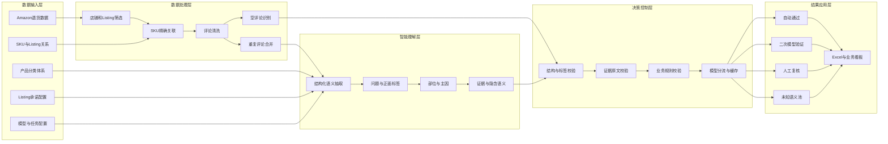
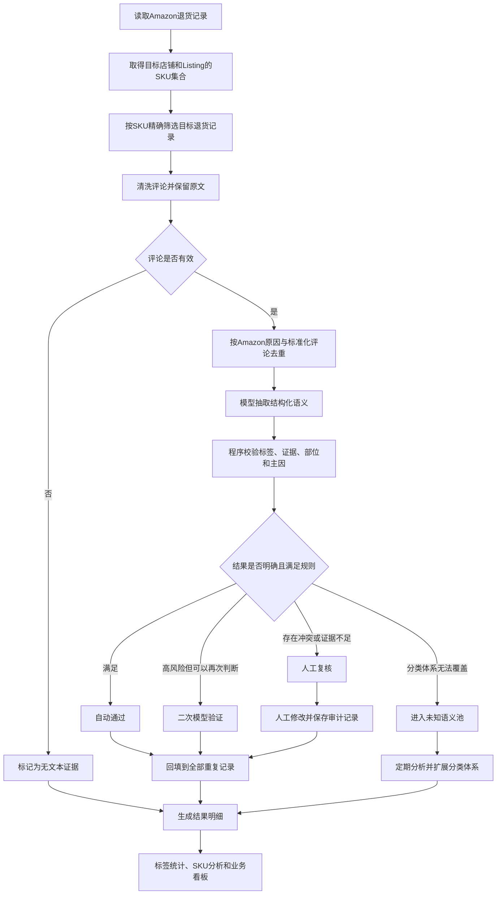
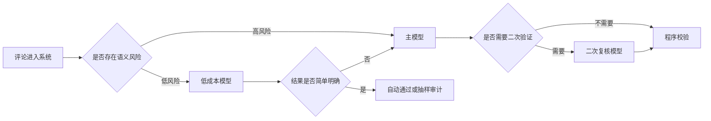

# 退货语义分析智能体项目汇报

> 汇报日期：2026年8月10日  
> 当前阶段：技术闭环和SK001全量运行已完成，业务准确率验收待完成

## 一、汇报摘要

本项目面向Amazon退货数据，目标是把客户退货评论转化为可追溯、可统计、可执行的产品问题信号。

项目已经完成从原始退货数据、AI语义分类、程序规则校验、人工复核到Excel和业务看板的技术闭环，并完成SK001共9,119条退货记录的全量处理。

当前项目可以证明“技术流程已经跑通”，但还不能证明“业务准确率已经达到正式使用标准”。下一阶段的重点是完成500条人工金标准标注，计算准确率等验收指标，并将人工复核比例从当前16.24%优化到10%以内。

## 二、为什么要做这个项目

### 2.1 当前业务问题

- Amazon提供的退货原因颗粒度较粗，无法直接定位具体产品问题。
- 客户评论是非结构化文本，依靠人工逐条阅读效率低、判断标准不统一。
- 运营、产品和供应链缺少能够追溯到评论原文的分析依据。
- 当前数据通常只能回答“退了多少”，难以回答“为什么退、涉及什么部位、是否与Listing承诺有关”。
- 单条评论可能同时包含多个问题、正面评价、比较、否定或隐含表达，普通关键词统计难以准确处理。

### 2.2 项目目标

系统需要实现：

- 自动识别评论中的问题标签、正面标签和主要退货原因。
- 将问题关联到具体产品部位或属性。
- 每个语义结论都能够回到客户评论中的原文证据。
- 判断评论是否可能与Listing承诺存在冲突。
- 区分自动通过、二次模型验证、人工复核、未知语义和无文本证据。
- 按标签、SKU、ASIN和Listing等维度形成业务统计结果。

## 三、智能体的设计思路

### 3.1 核心定位

这不是一个让大模型自由决策的智能体，而是一套“模型理解语义、程序执行规则、人工处理不确定性”的受控语义分析系统。

系统内部采用受控状态机，不允许模型自主修改标签体系、产品关系或业务规则。

### 3.2 三层职责分工

#### 模型负责理解

- 拆解评论中的多个语义问题。
- 判断问题、正面反馈、部位、主因和证据。
- 识别隐含表达、否定、比较、转折和未知语义。
- 输出符合固定结构的JSON结果。

#### 程序负责控制

- 精确筛选店铺、Listing和SKU。
- 校验标签、证据、部位、主因和Listing承诺编号。
- 检查Amazon原因与评论是否存在方向冲突。
- 决定自动通过、二次验证还是人工复核。
- 保存模型、提示词、分类体系和任务版本。

#### 人工负责最终判断

- 处理语义冲突、证据不足和分类体系无法覆盖的问题。
- 修正模型结果并填写修改原因。
- 保留修改前后内容、操作者和操作时间。
- 将人工修正样本沉淀为后续评测和优化数据。

### 3.3 设计原则

1. 评论是主要语义证据，Amazon原因是辅助证据。
2. 先抽取语义事实，再映射业务标签。
3. 空评论不推测具体产品问题。
4. 产品和Listing信息只能辅助判断，不能创造客户没有表达的问题。
5. 一条评论可以同时包含多个问题标签和正面标签。
6. 主因只能来自已经确认的问题标签。
7. 证据无法在原评论中找到时，不能自动通过。
8. 无法稳定判断的内容进入人工复核，不强行分类。
9. 分类体系无法覆盖的内容进入未知语义池，不统一塞入“其他”。

## 四、总体架构

五层架构分别解决：

- 数据输入层：明确分析对象和业务知识边界。
- 数据处理层：保证输入数据准确并减少重复调用。
- 智能理解层：理解客户真正表达的问题。
- 决策控制层：判断AI结果是否可信、是否需要升级处理。
- 结果应用层：将语义结果转化为业务人员可使用的明细和统计。

## 五、数据流

### 5.1 一条退货记录的处理过程

### 5.2 模型分流过程

这种设计在保证准确性的同时，避免所有评论都使用高成本模型。

### 5.3 示例

客户评论：

> 鞋子偏小，而且鞋底太薄，走路硌脚。

模型会拆分为多个语义单元：

| 语义单元 | 标签 | 部位 | 原文证据 |
| --- | --- | --- | --- |
| 尺码偏小 | 尺码偏小 | 整体 | 鞋子偏小 |
| 鞋底偏薄 | 偏薄 | 鞋底 | 鞋底太薄 |
| 穿着不舒服 | 不舒服 | 脚部/鞋底 | 走路硌脚 |

程序随后检查标签是否合法、证据是否存在、主因是否来自问题标签。如果“鞋底太薄”能否进一步推断为“保护不足”不够明确，则进入二次验证或人工复核。

## 六、涉及的主要技术

| 技术层 | 主要技术 | 作用 |
| --- | --- | --- |
| 数据处理 | Python 3.11、Pandas | 数据读取、筛选、关联、清洗、去重和统计 |
| 文件处理 | OpenPyXL、CSV、Excel多Sheet | 读取产品关系，输出分类、复核和统计结果 |
| AI语义理解 | DeepSeek及兼容Responses接口的大模型 | 结构化理解评论中的问题、部位、主因和证据 |
| 结构化输出 | Pydantic、JSON Schema | 约束模型输出格式，支持程序校验 |
| 决策控制 | Python校验规则、语义防护规则 | 防止无证据分类、标签越界和过度推断 |
| 模型调度 | 多模型路由、线程池、限流、重试、JSONL缓存 | 平衡准确率、成本和处理速度 |
| Web后端 | FastAPI、Uvicorn、SQLite | 提供账号、数据、任务、复核和配置接口 |
| Web前端 | React 19、Vite、JavaScript、CSS | 提供任务驾驶舱、人工复核和配置界面 |
| 实时进度 | SSE | 向前端推送任务进度和事件 |
| 安全与审计 | Cookie会话、密码哈希、Fernet加密、乐观锁 | 保护账号和API密钥，避免多人修改冲突 |
| 分析展示 | React、Excel | 提供统计分析和业务看板 |
| 部署 | Docker、Docker Compose、Caddy | 容器化部署、HTTPS、健康检查和备份 |
| 测试 | Pytest、FastAPI TestClient、Node.js Test | 单元测试、集成测试和Web任务流程测试 |

当前没有训练自有模型，也没有进行模型微调。核心方案是“大模型结构化语义抽取 + 确定性程序规则 + 人工复核闭环”。

## 七、已经完成的成果

### 7.1 数据处理成果

| 指标 | 当前结果 |
| --- | ---: |
| SK001退货记录 | 9,119条 |
| 有效评论记录 | 5,740条 |
| 无有效评论记录 | 3,379条 |
| 去重后的分类对象 | 3,338组 |
| 自动通过记录 | 4,808条 |
| 自动通过占有效评论 | 83.76% |
| 需要复核的记录 | 932条 |
| 复核占有效评论 | 16.24% |

无评论记录没有生成具体语义问题，符合“不允许AI无证据推断”的设计原则。

### 7.2 已实现能力

- 多问题、多标签和并列主因识别。
- 正面信息和退货问题分开保存。
- 标签、部位、证据、主因和Listing承诺校验。
- 低成本模型、主模型和二次复核模型分流。
- 模型结果缓存、失败重试和断点复用。
- 人工复核、修改留痕和版本冲突检查。
- 多Sheet Excel结果文件。
- 任务、数据版本、模型配置和复核Web界面。
- 容器部署、健康检查和备份方案。

### 7.3 测试情况

- Python语义和Web测试：74条通过。
- Sites Worker测试：4条通过。
- 已覆盖数据基线、模型客户端、模型路由、语义规则、导出、Web任务、人工复核、备份和生产配置预检。

## 八、当前阶段判断

| 维度 | 当前状态 | 说明 |
| --- | --- | --- |
| 技术可行性 | 已完成 | 端到端流程可以运行 |
| SK001全量处理 | 已完成 | 9,119条记录已经输出 |
| Web产品化 | 基本完成 | 已实现主要协同功能 |
| 业务准确率验收 | 待完成 | 金标准尚未人工标注 |
| 生产环境验证 | 待完成 | 需要真实配置和备份恢复演练 |

因此，当前项目应定义为“功能完整的工程测试版”，尚不能定义为“已经完成业务验收的正式生产系统”。

## 九、当前差距与风险

### 9.1 业务准确率缺少人工验证

已经抽取500条金标准样本，其中：

- 300条用于提示词、规则校准和错误分析。
- 200条作为不可见验收集。

但人工问题标签、主因、部位、证据和未知语义字段目前尚未完成标注，因此暂时无法计算：

- Micro和Macro Precision、Recall、F1。
- 主因准确率。
- 证据匹配通过率。
- 自动通过结果是否达到95%精度目标。

### 9.2 人工复核比例偏高

当前932条有效评论需要复核，占有效评论16.24%，高于设计目标5%至10%。

当前最大的复核来源是隐含尺码语义和不同模型结果不一致，需要优先优化，但不能为了降低复核比例而降低自动通过标准。

### 9.3 Web任务中的Listing承诺配置需要补齐

整体设计包含Listing承诺关系判断，现有离线结果也保留了该字段，但当前Web任务执行链路仍需要补齐Listing承诺配置，完成后才能保证离线和Web结果一致。

### 9.4 项目范围需要重新确认

项目最初以SK001离线分析为首版范围，当前已经扩展到多用户Web协同系统。下一阶段需要确认：

- 正式交付是否仍以SK001为主。
- 是否需要立即扩展其他Listing。
- Web系统是内部试用还是直接进入生产部署。

### 9.5 工程基线需要固化

- 当前代码仓库尚未建立正式版本提交历史。
- 原始输入数据、临时文件和代码索引目录需要与源码隔离。
- 开发环境和生产环境的部分依赖版本需要统一。
- 前后端部分文件体量较大，后续应按业务边界逐步拆分。

## 十、下一阶段计划

### 第一阶段：完成业务验收

- 完成500条金标准人工标注。
- 使用300条校准样本优化提示词和规则。
- 使用200条不可见样本计算最终验收指标。
- 对自动通过结果进行人工抽检。
- 形成是否达到正式使用标准的验收结论。

### 第二阶段：完成重点优化

- 补齐Web任务的Listing承诺配置。
- 优化隐含尺码语义的模型分流和校验规则。
- 分析复核原因排名，优先处理高频问题。
- 将人工复核比例控制到10%左右，同时保证自动通过精度。

### 第三阶段：完成上线准备

- 固化代码、分类体系、提示词和模型版本。
- 使用真实模型配置和真实数据进行Web端到端演练。
- 验证任务失败恢复、数据备份和数据库恢复。
- 完成生产环境安全和性能检查。
- 验收通过后先进行小范围内部试用。

## 十一、需要管理层确认的事项

1. 是否确认首期业务范围继续聚焦SK001。
2. 由谁负责完成500条人工金标准标注。
3. 人工标注和最终验收的目标时间。
4. 验收通过后，是先内部试用还是直接扩展其他Listing。
5. 当前是否暂停新增界面功能，优先完成准确率验收和关键缺口修复。
6. 是否批准进入正式生产部署准备阶段。

## 十二、汇报结论

项目已经完成从退货原始数据、语义理解、程序校验、人工复核到业务分析的技术闭环，并完成SK001全量数据处理。

智能体的核心价值不只是调用大模型，而是建立了一套可追溯、可控制、可人工纠偏的退货语义决策流程。

当前最重要的工作不是继续增加功能，而是通过500条人工金标准证明分类准确率，修复Web端Listing承诺配置，并完成真实环境的上线演练。业务验收通过后，项目才具备扩展到其他Listing和品类的基础。

## 附录：建议会议节奏

| 内容 | 建议时间 |
| --- | ---: |
| 项目背景和目标 | 2分钟 |
| 智能体设计与数据流 | 4分钟 |
| 当前成果和业务数据 | 3分钟 |
| 风险与差距 | 2分钟 |
| 下一阶段计划和决策事项 | 2分钟 |
| 系统演示 | 可选3分钟 |

建议整场汇报控制在12至15分钟。
